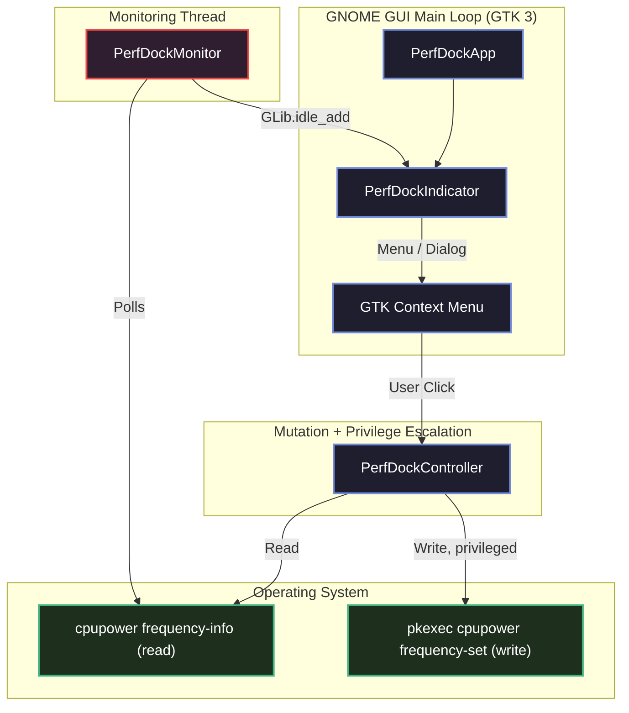

# ⚡ Perf-Dock

> A lightweight GNOME top-bar tray indicator and controller for `cpupower` CPU frequency scaling. Built with Python, PyGObject, and Ayatana AppIndicator — modeled on the sibling project [`nerd-dock`](../nerd-dock).

---

## Contents

- [Product highlights](#-product-highlights)
- [Installation](#-getting-started)
- [Usage](#-usage)
- [Developer automation](#-developer-automation--quality-gates)
- [Project documentation](#-repository-navigation)
- [Shell extension architecture](docs/SHELL_EXTENSION_ARCH.md)
- [User guide](docs/USER_GUIDE.md)
- [Sprint board](task.md)
- [Team coordination](agents/CHAT.md)

---

## 🌟 Product Highlights

*   **One-Click Governor Switching:** Flip between `performance`, `powersave`, and balanced governors directly from the GNOME top bar — no terminal required.
*   **KISS Shell Extension:** GNOME Shell 50 users get one alphabetized strip of every available governor, with distinct icons, direct selection, hover help, and no duplicate popup controls.
*   **Custom Frequency Ranges:** Pin a custom min/max CPU frequency via a simple dialog populated from your hardware's actual supported steps.
*   **Live State Sync:** A background poll thread detects governor/frequency changes made elsewhere (CLI, another tool) and updates the tray within one poll cycle.
*   **Safe Privilege Escalation:** Only the moment-of-change (`cpupower frequency-set`) requests elevated privileges via `pkexec` — Perf-Dock never holds standing root access.
*   **Runtime Hardware Discovery:** Governors and frequency steps are read from your hardware/driver at runtime, never hardcoded.

---

## 📊 Performance States & Visuals

| State | Tray Icon | Menu | Tooltip | Trigger |
| :--- | :--- | :--- | :--- | :--- |
| **`PERFORMANCE`** | 🔴 Hot gauge | Governor list highlights "Performance" | `"Perf-Dock: Performance"` | Governor is `performance` at full hardware range. |
| **`POWERSAVE`** | 🟢 Cool gauge | Governor list highlights "Powersave" | `"Perf-Dock: Power Saver"` | Governor is `powersave` at full hardware range. |
| **`BALANCED`** | 🔵 Neutral gauge | Governor list highlights active governor | `"Perf-Dock: Balanced (<governor>)"` | Governor is `ondemand`/`schedutil`/`conservative`/`userspace` at full range. |
| **`CUSTOM`** | 🟣 Pinned gauge | "Restore Default Range" appears | `"Perf-Dock: Custom <min>-<max>"` | Policy min/max narrower than hardware's full reported range. |
| **`ERROR`** | ⚠️ Warning | Only the status item is clickable | `"Perf-Dock: cpupower not available"` | `cpupower` missing or unparseable on this system. |

---

## 🛠️ Architecture & Data Flow

See [docs/ARCH.md](docs/ARCH.md) for the full component design. High level:



---

## 🚀 Getting Started

### 📋 Prerequisites

```bash
make install-system-deps
```

Installs `python3-gi`, GTK3/Ayatana GObject bindings, libnotify, `policykit-1`, and the `cpupower` CLI (`linux-tools-*` on Debian/Ubuntu).

### 📦 Installation

```bash
git clone <this-repo>
cd perf-dock
make install-system-deps
pipx install . --system-site-packages
make install-polkit
```

For the GNOME Shell 50 six-button interface:

```bash
make install-extension
make enable-extension
```

Log out and back in after first installation (and after extension source
updates on Wayland). The extension shows every available governor directly and
has no popup menu. The standalone AppIndicator retains the custom frequency
range and lifecycle controls.

Or for local development:

```bash
make setup   # creates venv, installs dev dependencies from pyproject.toml
```

`make install-polkit` asks for your administrator password once to install a
root-owned, narrowly scoped helper. Polkit then retains approval briefly, so
several governor or range changes do not each produce another password prompt.
It does not store your password or authorize arbitrary `pkexec` commands.

---

## 💻 Usage

```bash
make run
```

### ⚙️ Command-Line Arguments

| Flag | Type | Default | Description |
| :--- | :--- | :--- | :--- |
| `--poll-interval` | `float` | `1.5` | Background monitor polling interval, in seconds. |
| `--verbose` | flag | `False` | Enable debug-level logging. |

---

## 🧪 Developer Automation & Quality Gates

```bash
make test    # unit tests, all subprocess/cpupower calls mocked — no root or real hardware needed
make e2e     # boots the real app for a few seconds against real cpupower/GTK, verifies clean start/stop
make lint    # ruff, radon, vulture, bandit, pylint duplicate-code
make format  # ruff format + autofix
make clean   # remove build artifacts/caches
```

> `make e2e` exists because mocked tests can validate a self-consistent bug — see `agents/oracle.docs/lessons.md` (2026-07-29) for the real defect this caught. It skips gracefully (exit 0) if no `DISPLAY`/`WAYLAND_DISPLAY` is available, e.g. in headless CI.

---

## 📂 Repository Navigation

*   [perf_dock/main.py](perf_dock/main.py) — entry point and CLI args.
*   [perf_dock/cpufreq.py](perf_dock/cpufreq.py) — read-only `cpupower` subprocess wrapper and parsing.
*   [perf_dock/state.py](perf_dock/state.py) — pure state-classification logic.
*   [perf_dock/controller.py](perf_dock/controller.py) — mutating actions and the pkexec privilege-escalation path.
*   [perf_dock/monitor.py](perf_dock/monitor.py) — background poll thread.
*   [perf_dock/ppd_check.py](perf_dock/ppd_check.py) — power-profiles-daemon detection (advisory only).
*   [perf_dock/ui_indicator.py](perf_dock/ui_indicator.py) — Ayatana AppIndicator tray, menu, and frequency dialog.
*   [docs/PRD.md](docs/PRD.md) — Product Requirements Document.
*   [docs/ARCH.md](docs/ARCH.md) — Technical Architecture Design Document.
*   [docs/SHELL_EXTENSION_ARCH.md](docs/SHELL_EXTENSION_ARCH.md) — GNOME Shell 50 extension architecture and verification strategy.
*   [docs/USER_STORIES.md](docs/USER_STORIES.md) — User stories and acceptance criteria.
*   [docs/USER_GUIDE.md](docs/USER_GUIDE.md) — End-user setup and usage guide.

---

## 📄 License

This project is licensed under the MIT License. See [LICENSE](LICENSE) for details.
