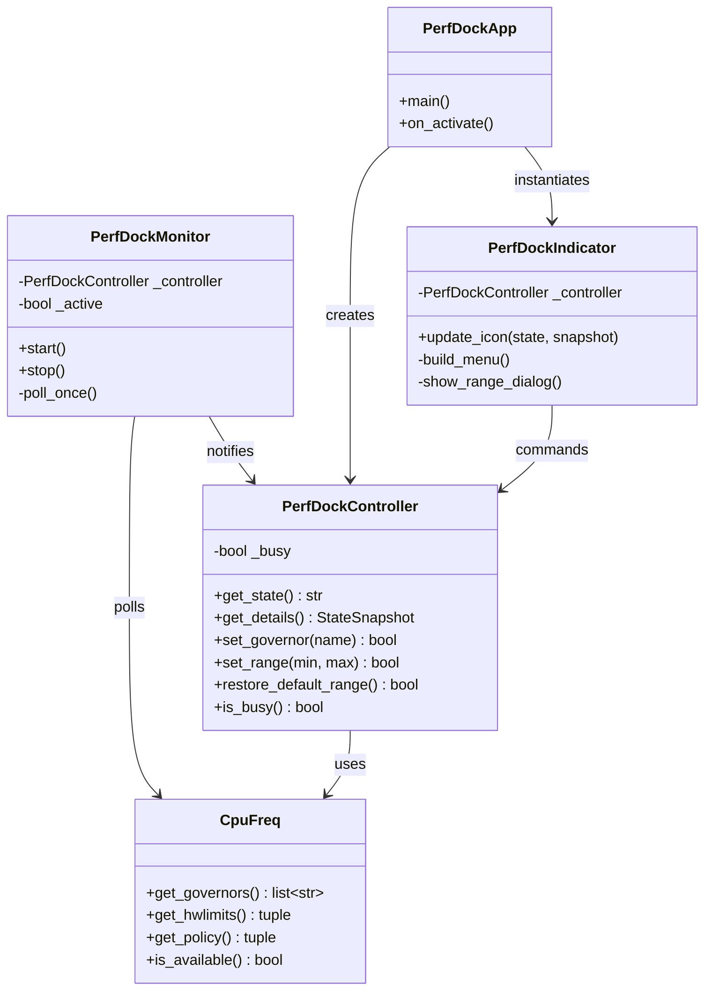

# Architecture Design Document — Perf-Dock

**Author:** Morpheus (Tech Lead & Architect)
**Date:** 2026-07-29
**Status:** Draft — Pending Smith (Gate 2) Review

---

## 1. Package Structure
```
perf-dock/
├── Makefile.prj                # Project automation script (mirrors nerd-dock)
├── pyproject.toml              # PEP 518 build system & dependencies
├── perf_dock/
│   ├── __init__.py             # Module exports
│   ├── main.py                 # Application entry point, CLI args
│   ├── cpufreq.py              # Low-level cpupower subprocess wrappers + output parsing (read-only)
│   ├── state.py                # Pure state-classification logic (PERFORMANCE/POWERSAVE/BALANCED/CUSTOM/ERROR)
│   ├── controller.py           # PerfDockController: mutating actions + privilege escalation
│   ├── monitor.py               # PerfDockMonitor: background poll thread
│   ├── ppd_check.py             # power-profiles-daemon detection (best-effort, non-fatal)
│   ├── ui_indicator.py          # Ayatana AppIndicator tray, menu, frequency dialog
│   └── resources/icons/*.svg   # performance / powersave / balanced / custom / error icons
└── tests/
    ├── __init__.py
    ├── test_state.py
    ├── test_cpufreq.py
    ├── test_controller.py
    └── test_monitor.py
```

---

## 2. Component Design

### 2.1. `cpufreq.py` — Read-Only Query Layer
Wraps `cpupower frequency-info` using **targeted flags**, not the full-text dump, to keep parsing robust:
- `get_governors() -> list[str]` — parses `cpupower frequency-info -g` (`available cpufreq governors: ...`).
- `get_hwlimits() -> tuple[int, int]` — parses `cpupower frequency-info -l` (two whitespace-separated kHz integers — the only flag with clean machine-readable output).
- `get_policy() -> tuple[str, int, int]` — parses `cpupower frequency-info -p` for `(governor, policy_min_khz, policy_max_khz)` via regex on `within X and Y` / `governor "G"`. Frequencies are converted from the printed unit (Hz/kHz/MHz/GHz) to a common kHz integer.
- `is_available() -> bool` — `shutil.which("cpupower")` at startup; cached once.
- All functions raise a single `CpuFreqUnavailableError` on missing binary or unparseable output — callers (controller/monitor) catch this once and surface `STATE_ERROR`, never let a raw `CalledProcessError`/regex failure bubble to the UI layer.

### 2.2. `state.py` — Pure Classification Logic
No subprocess calls, no I/O — a pure function, trivially unit-testable without mocks:
```python
def classify_state(governor: str, policy_min: int, policy_max: int, hw_min: int, hw_max: int) -> str:
    if (policy_min, policy_max) != (hw_min, hw_max):
        return STATE_CUSTOM
    return _GOVERNOR_STATE_MAP.get(governor, STATE_BALANCED)
```
- `_GOVERNOR_STATE_MAP = {"performance": STATE_PERFORMANCE, "powersave": STATE_POWERSAVE}`; anything else (`ondemand`, `schedutil`, `conservative`, `userspace`) → `STATE_BALANCED`.
- Constants: `STATE_PERFORMANCE`, `STATE_POWERSAVE`, `STATE_BALANCED`, `STATE_CUSTOM`, `STATE_ERROR`.

### 2.3. `controller.py` — `PerfDockController`
Owns mutating actions and the single privilege-escalation path.
- **Public methods:**
  - `get_state() -> str`, `get_details() -> StateSnapshot` (governor, min, max, hw_min, hw_max)
  - `set_governor(name: str) -> bool`
  - `set_range(min_khz: int | None, max_khz: int | None) -> bool` — either bound may be `None` (US-2 amendment: independent min/max).
  - `restore_default_range() -> bool` — convenience wrapper calling `set_range(hw_min, hw_max)` (US-1 amendment: escape hatch).
- **Privilege escalation (resolves Risk #1 from PRD §5):**
  - v1 uses **plain `pkexec <absolute-path-to-cpupower> -r frequency-set ...`** — no custom `.policy` file.
  - Rationale: `pkexec` on an admin-authorized user already prompts per-invocation via the stock `org.freedesktop.policykit.pkexec.run-user-supplied-program` action; this satisfies US-4 (no standing privilege, explicit single escalation call) with zero extra install steps (no root-owned `.policy` XML to package/ship). A custom scoped policy action (nicer prompt copy, `auth_admin_keep` tuning) is a valid v2 enhancement, not required for v1 — recorded as a backlog item, not a blocker.
  - The absolute path to `cpupower` is resolved once via `cpufreq.py`'s `shutil.which` and passed explicitly to `pkexec` (pkexec requires an absolute path; never rely on `$PATH` resolution inside the escalated call).
  - A cancelled/denied `pkexec` prompt returns a non-zero exit code; `controller.py` treats this as "no state change", logs it, and returns `False` — it does not raise, retry, or leave a half-applied state (US-4).
- **Logic Safeguards:** mirrors nerd-dock's `TRANSITIONING`-style lock — controller exposes `is_busy()` so the UI can disable menu items mid-call and avoid double-submitting a privileged action while a `pkexec` prompt is open.

### 2.4. `monitor.py` — `PerfDockMonitor`
Background poll thread, directly analogous to nerd-dock's `NerdDictationMonitor`:
- Polls `cpufreq.get_policy()` + `cpufreq.get_hwlimits()` on a fixed interval (default 1.5s, `--poll-interval` CLI flag).
- Diffs against last-known snapshot; on change, computes new state via `state.classify_state` and dispatches via `GLib.idle_add(callback, new_state, snapshot)`.
- On `CpuFreqUnavailableError`, dispatches `STATE_ERROR` once (does not spam retries faster than the poll interval).

### 2.5. `ppd_check.py` — power-profiles-daemon Detection (resolves Risk #2 from PRD §5)
- **Decision:** v1 does **not** attempt to stop, disable, or fight `power-profiles-daemon`. It only detects and informs.
- `is_ppd_active() -> bool` — best-effort `systemctl is-active power-profiles-daemon` check (any failure/absence → `False`, never raises — this is advisory only).
- If active, `ui_indicator.py` appends a fixed advisory line to the tray tooltip/menu: *"Note: power-profiles-daemon is also active and may override this on its next profile switch."* This is transparency (Nielsen #1, #9), not a fix — a v2 backlog item is "offer to pause power-profiles-daemon while Perf-Dock is running."

### 2.6. `ui_indicator.py` — `PerfDockIndicator`
Ayatana AppIndicator tray applet, menu, and the frequency-range dialog.
- **Dynamic Icons:** `STATE_PERFORMANCE` → hot icon, `STATE_POWERSAVE` → cool icon, `STATE_BALANCED` → neutral icon, `STATE_CUSTOM` → distinct pin icon, `STATE_ERROR` → warning icon.
- **Menu:** governor entries built at runtime from `cpufreq.get_governors()` (never hardcoded — PRD §5 risk "hardware/driver variability"); "Set Frequency Range..."; "Restore Default Range" (visible only in `STATE_CUSTOM`); "Refresh"; "Quit".
- **Error state menu:** if `cpufreq.is_available()` is `False`, the only enabled entry is the install-hint notification (US-1 amendment).
- **Frequency dialog:** GTK dialog populated from the hardware's actual frequency step list (not free text), each bound independently optional.

---

## 3. High-Level Class Relationships



---

## 4. Threading & Thread-Safety Model
Identical rule to nerd-dock — GTK is not thread-safe.
- **Rule:** `PerfDockMonitor`'s background thread MUST NOT touch GTK/Indicator widgets directly.
- **Solution:** dispatch via `GLib.idle_add(ui_callback, new_state, snapshot)` exclusively.
- **Privileged calls run on the main thread** (triggered by a menu click), not the monitor thread — `pkexec`'s graphical auth prompt requires this, and it also means `is_busy()` can synchronously gate the menu without extra locking.

---

## 5. Resolved Risks (from PRD §5)
| Risk | Resolution | Deferred to v2 |
|---|---|---|
| Privilege escalation approach | Plain `pkexec <absolute cpupower path> -r frequency-set ...`, default polkit policy | Custom scoped `.policy` action for nicer prompt copy |
| power-profiles-daemon conflict | Detect via `systemctl is-active`, surface as advisory tooltip/menu text only | Offer to pause `power-profiles-daemon` while Perf-Dock runs |
| Hardware/driver variability | All governor/frequency data read at runtime via `cpufreq.py`, never hardcoded | — |
