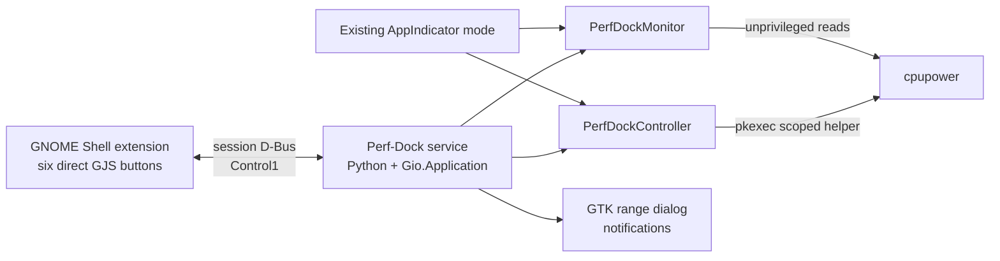

# Shell Extension Architecture — Perf-Dock

**Author:** Morpheus (Tech Lead)
**Date:** 2026-07-30
**Status:** Implemented and live-tested on GNOME Shell 50.1

## 1. Decision Summary

Perf-Dock will add a GNOME Shell 50 extension as a new presentation layer. The
extension owns six direct panel controls plus hover/focus help. A
D-Bus-activatable Python session service owns hardware
queries, monitoring, dialogs, notifications, and all privileged mutations.

The existing AppIndicator UI remains available as a fallback execution mode.
The extension does not import Python, execute `cpupower`, or invoke `pkexec`
directly.

## 2. Supported Environment

- Initial supported Shell ABI: GNOME Shell 50 (the target machine runs 50.1).
- Extension language/runtime: GJS ES modules.
- Extension UUID: `perf-dock@drusifer`.
- Session service bus name: `io.github.perf_dock`.
- Object path: `/io/github/perf_dock`.
- Interface: `io.github.perf_dock.Control1`.

GNOME Shell versions are declared in `metadata.json`; support for another major
version requires its own nested-Shell smoke pass before adding it. The design
follows GNOME's documented `PanelMenu.Button` extension pattern and uses an
asynchronous `Gio.DBusProxy` so Shell's main loop is never blocked.

## 3. Runtime Components

### 3.1 Shell extension

`shell-extension/` contains:

- `metadata.json` — UUID and explicit Shell 50 compatibility.
- `extension.js` — lifecycle, D-Bus proxy, and six-button panel composition.
- `stylesheet.css` — grouped controls, active, pending, focus, and error states.
- GNOME theme symbolic icons — distinct visuals for all six governors.
- `schemas/org.gnome.shell.extensions.perf-dock.gschema.xml` — retained for
  compatibility with earlier development builds; the final KISS surface has no
  user-configurable visibility state.
- `lib/model.js` — pure state-to-view projection, independently testable in GJS.
- `dbus/io.github.perf_dock.Control1.xml` — copied contract used by proxy tests.

The panel surface registers one menu-free `PanelMenu.Button` container holding
a public `St.BoxLayout`. It renders every governor reported by the target
driver—six on the target machine—as alphabetically ordered `St.Button`
controls. There is no hamburger or popup menu. This guarantees a contiguous
visual group while avoiding private Shell panel APIs.

### 3.2 Python service

`perf_dock/service.py` exports `Control1` on the user's session bus and composes
the existing `PerfDockController` and `PerfDockMonitor`. D-Bus activation starts
it on demand. It has no root privileges; mutations continue through the scoped
Polkit helper.

The existing `perf-dock` entry point gains explicit modes:

- default / `--indicator`: current AppIndicator UI.
- `--gapplication-service`: D-Bus-activated backend with no AppIndicator.

Common controller/monitor instances are composed by a small application layer;
the service and AppIndicator do not duplicate hardware logic.

## 4. D-Bus Contract (`Control1`)

The interface is versioned at `Control1`. Breaking changes require `Control2`;
additive methods/signals may extend version 1.

### Methods

- `GetSnapshot() -> a{sv}` — state, governor, policy min/max, hardware min/max,
  busy flag, and optional error text.
- `GetGovernors() -> as` — runtime-discovered governor names.
- `SetGovernor(s name) -> (b accepted, s message)` — validates availability,
  performs the existing privileged operation, and returns an actionable result.
- `ShowRangeDialog()` — opens the existing GTK frequency-range dialog through
  the backend application.
- `RestoreDefaultRange() -> (b accepted, s message)`.
- `Refresh() -> a{sv}`.
- `Quit()` — exits the explicitly running backend; a later extension request may
  activate it again.

### Signal

- `SnapshotChanged(a{sv} snapshot)` — emitted after monitor-detected or requested
  state changes.

No D-Bus method accepts executable paths, argv arrays, frequency command text,
or arbitrary Polkit action IDs.

## 5. Panel Behavior

- Every governor reported as available by the active driver receives a panel
  button; there is no visibility configuration.
- Each governor button is a one-click action. Active state uses background/shape
  plus accessible checked state. Pending state disables all governor buttons
  until the asynchronous method returns.
- Hover and keyboard focus expose the governor display name, an `Active` marker
  when selected, and a short description of its scaling behavior. Governors do
  not own separate frequency ranges, so tooltips do not invent per-mode limits.
- The extension intentionally exposes no frequency-range, quit, restart, or
  visibility controls. Those richer operations remain in the standalone
  AppIndicator application.
- Backend disappearance disables the buttons and starts bounded automatic
  reconnection. A persistent unavailable state is treated as an operational
  fault, never as a normal user-selectable state.

## 6. Installation and Lifecycle

Repeatable Make targets will:

- install the extension and compile its schema under the user's
  `~/.local/share/gnome-shell/extensions/perf-dock@drusifer/` directory;
- install the D-Bus activation file under
  `~/.local/share/dbus-1/services/io.github.perf_dock.service`;
- enable/disable the extension;
- uninstall only user-level extension/service files.

The scoped Polkit helper is a separate system installation and is never removed
by extension uninstall. Installation must validate Shell major version 50 before
enabling.

## 7. Verification Strategy

1. Python unit/contract tests mock D-Bus transport and cover service methods,
   validation, signal payloads, failures, and reconnect-visible state.
2. GJS unit tests cover the pure model: alphabetical ordering, active/pending/
   error projection, D-Bus Variant normalization, icons, and tooltip text.
3. Static checks validate metadata, JSON, XML, schema compilation, JavaScript
   syntax, and extension packaging.
4. A GNOME 50 nested Wayland session (`gnome-shell --devkit --wayland`) verifies
   actor creation, backend activation, error-free loading, and clean
   disable/re-enable.
5. The existing Python tests, lint, and AppIndicator e2e remain regression gates.

## 8. Explicit Non-Decisions

- No direct cpupower/pkexec subprocesses from GJS.
- No private `Main.panel._rightBox` manipulation.
- No four-independent-AppIndicator workaround.
- No automatic power-profiles-daemon shutdown.
- No claim of GNOME 45–49 compatibility without explicit testing.

## References

- GNOME extension panel-button pattern: https://gjs.guide/extensions/development/creating.html
- GJS D-Bus proxies and name-owner recovery: https://gjs.guide/guides/gio/dbus.html
- GNOME D-Bus activation guidance: https://developer.gnome.org/documentation/guidelines/maintainer/integrating.html
- GNOME 50 porting notes: https://gjs.guide/extensions/upgrading/gnome-shell-50.html
